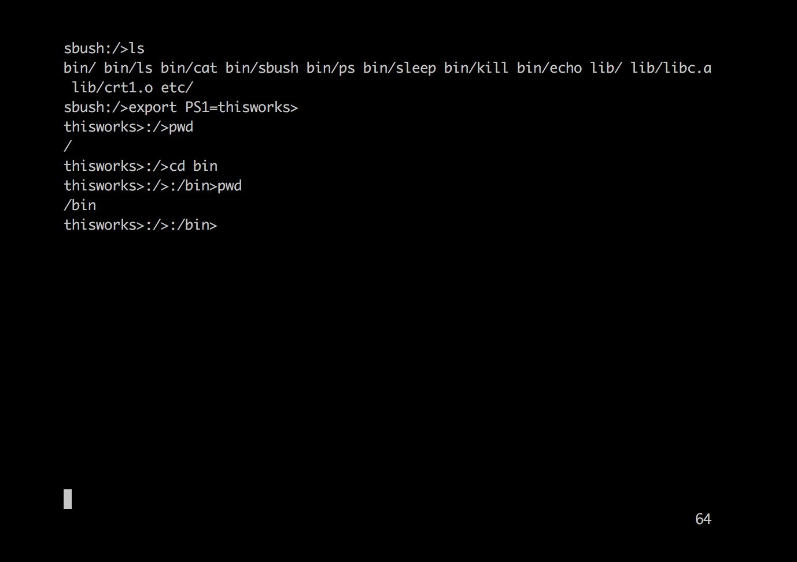

## x86_64 Operating System

Operating System implementation as a course project for CSE 506 under Prof. Michael Ferdman. It has Cooperative multi-tasking with below functionalities :

  1) All functions from include/*.h must work
  2) Virtual memory/ring-3 user processes
  3) COW fork(), auto-growing stack, graceful SEGV
  4) tarfs: open, read, close, opendir, readdir, closedir
  5) read(stdin), write(stdout), write(stderr)
  6) Binaries: echo, sleep, cat, ls, kill -9, ps
  7) Command prompt - sbush

#### Suggested Plan of attack :

  1) Memory Subsystem (page descriptors, free list, page tables, kmalloc)
  2) rocess Subsystem (kernel threads, context switch)
  3) User-level Subsystem (VMAs/vm_map_entrys, switch to ring 3, page faults)
  4) I/O subsystem (syscalls, terminals, VFS, tarfs file access)
  5) Implement /bin/init (call fork()+exec()+wait() on /etc/rc, then exec() sbush)

#### The provided Makefile:
  1) builds a kernel
  2) copies it into rootfs/boot/kernel/kernel
  3) creates an ISO CD image with the rootfs/ contents

#### To boot the system in QEMU, run:
qemu-system-x86_64 -curses -drive id=boot,format=raw,file=$USER.img,if=none -drive id=data,format=raw,file=$USER-data.img,if=none -device ahci,id=ahci -device ide-drive,drive=boot,bus=ahci.0 -device ide-drive,drive=data,bus=ahci.1 -gdb tcp::9999

Explanation of parameters:
  -curses         use a text console (omit this to use default SDL/VNC console)
  -drive ...      connect a CD-ROM or hard drive with corresponding image
  -device ...     configure an AHCI controller for the boot and data disks
  -gdb tcp::9999  listen for "remote" debugging connections on port NNNN
  -S              wait for GDB to connect at startup
  -no-reboot      prevent reboot when OS crashes

When using the -curses mode, switch to the qemu> console with ESC-2.

#### To connect a remote debugger to the running qemu VM, from a different window:
gdb ./kernel

At the (gdb) prompt, connect with:
target remote localhost:9999

### Lot of help
<a href="http://wiki.osdev.org/Expanded_Main_Page">OSdev.org</a>
